# Table of Contents

- [Table of Contents](#table-of-contents)
  - [Introduction](#introduction)
  - [Prerequisites](#prerequisites)
    - [.NET 7.0](#net-70)
    - [Visual Studio 2022](#visual-studio-2022)
    - [Required Workloads](#required-workloads)
  - [Demo](#demo)
    - [Secure an ASP.NET Core Web API Application](#secure-an-aspnet-core-web-api-application)
      - [Create an ASP.NET Core Web API Application](#create-an-aspnet-core-web-api-application)
      - [Secure the ASP.NET Core Web API](#secure-the-aspnet-core-web-api)
      - [Azure AD B2C App Registration](#azure-ad-b2c-app-registration)
      - [Deploy ASP.NET Core Web API to Azure](#deploy-aspnet-core-web-api-to-azure)
      - [Configure Azure AD B2C Scope](#configure-azure-ad-b2c-scope)
      - [Set API Permissions](#set-api-permissions)
    - [Create a `.NET MAUI` application](#create-a-net-maui-application)
    - [Configure our `.NET MAUI` application to use `MSAL.NET` to authenticate users and get an access token](#configure-our-net-maui-application-to-use-msalnet-to-authenticate-users-and-get-an-access-token)
      - [PCAWrapper.cs](#pcawrappercs)
      - [PlatformConfig.cs](#platformconfigcs)
    - [Running on Android](#running-on-android)
      - [Call our secure `ASP.NET Core Web API` application from our `.NET MAUI` application](#call-our-secure-aspnet-core-web-api-application-from-our-net-maui-application)
    - [Running on iOS](#running-on-ios)
      - [Apple Developer Account](#apple-developer-account)
    - [Running on Windows](#running-on-windows)
  - [Summary](#summary)
  - [Complete Code](#complete-code)
  - [Resources](#resources)

## Introduction

> Watch the How-To video at https://thedotnetshow.com Look for episode 24.

In this episode, we are going to build a secure `ASP.NET Core Web API` application, and deploy it to `Azure`. Then, we are going to build a `.NET Multi-platform App UI (.NET MAUI)` application, and I am going to show you how you can leverage the`Microsoft Authentication Library (MSAL)` for `.NET` to get an access token, which we are going to use to call the Web API application.

The `Microsoft Authentication Library (MSAL)` allows you to acquire tokens from the `Microsoft identity platform`, authenticate users, and call secure web APIs not only from .NET, but from multiple platforms such as JavaScript, Java, Python, Android, and iOS.

You can find more information about `MSAL` here [Overview of the Microsoft Authentication Library (MSAL)](https://docs.microsoft.com/en-us/azure/active-directory/develop/msal-overview)

End results will look like this:

  

Let's get started.

## Prerequisites

The following prerequisites are needed for this demo.

### .NET 7.0

Download the latest version of the .NET 7.0 SDK [here](https://dotnet.microsoft.com/en-us/download).

### Visual Studio 2022

For this demo, we are going to use the latest version of [Visual Studio 2022](https://visualstudio.microsoft.com/vs/community/).

### Required Workloads

In order to build ASP.NET Core Web API applications, the `ASP.NET and web development` workload needs to be installed. In order to build `.NET MAUI` applications, you also need the `.NET Multi-platform App UI development` workload, so if you do not have them installed let's do that now.

Here's a screen shot of the Visual Studio Installer.

  

## Demo

In the demo we will perform the following actions:

1. Create a `ASP.NET Core Web API` application
2. Secure the `ASP.NET Core Web API` application
3. Create and configure an `Azure AD B2C` app registration to provide authentication workflows
4. Deploy the `ASP.NET Core Web API` application to Azure
5. Configure an `Azure AD B2C` Scope
6. Set API Permissions
7. Create a `.NET MAUI` application
8. Configure our `.NET MAUI` application to authenticate users and get an access token
9. Call our secure `ASP.NET Core Web API` application from our `.NET MAUI` application

As you can see there are many steps in this demo, so let's get to it.

### Secure an ASP.NET Core Web API Application

In this demo, we are going to start by creating an `ASP.NET Core Web API ` application using the default template, which will not be secure. We are going to make it secure by using the `Microsoft identity` platform.

We will create an `Azure AD B2C` app registration to provide an authentication flow, and configure our `ASP.NET Core Web API` application to use it.

And finally, we will deploy the `ASP.NET Core Web API` application to Azure.

#### Create an ASP.NET Core Web API Application

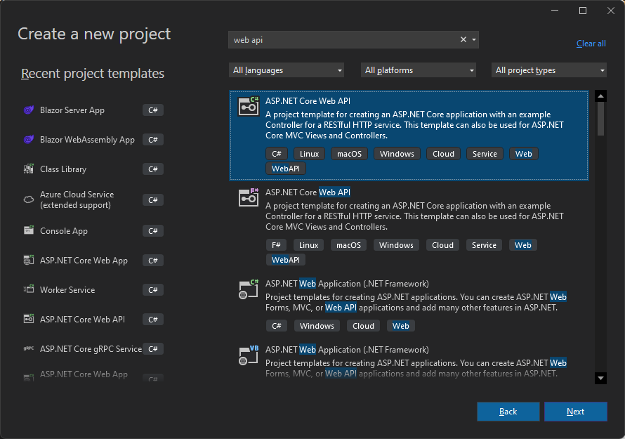  

Name it `SecureWebApi`

  

  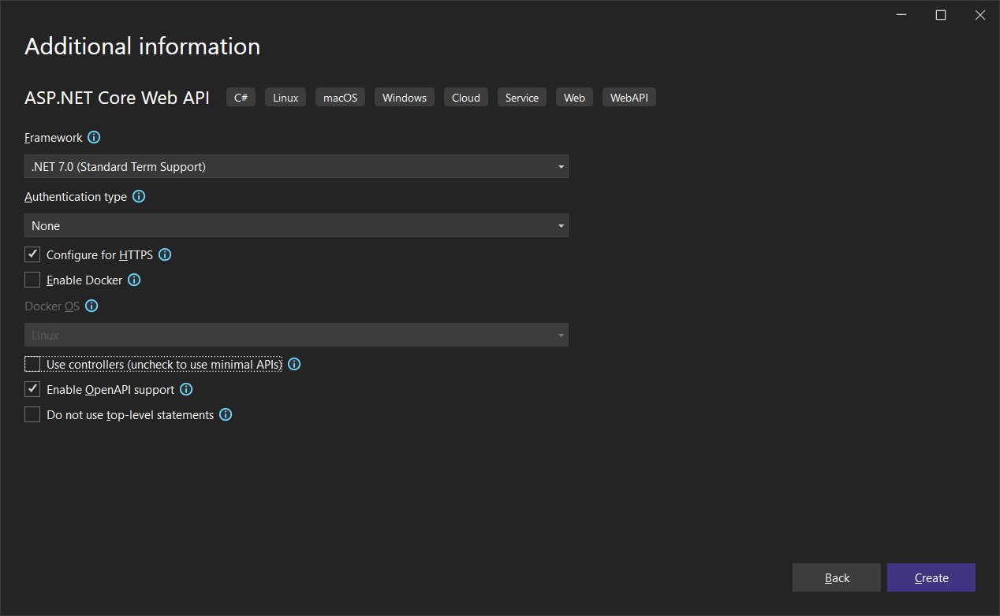

>:point_up: Notice I unchecked `Use controllers (uncheck to use minimal APIs)` to create a minimal API, and checked `Enable OpenAPI support` to include `Swagger`.

You can learn more about minimal APIs here: [Minimal APIs overview](https://docs.microsoft.com/en-us/aspnet/core/fundamentals/minimal-apis?view=aspnetcore-6.0>)

Run the application to make sure the default templates is working.

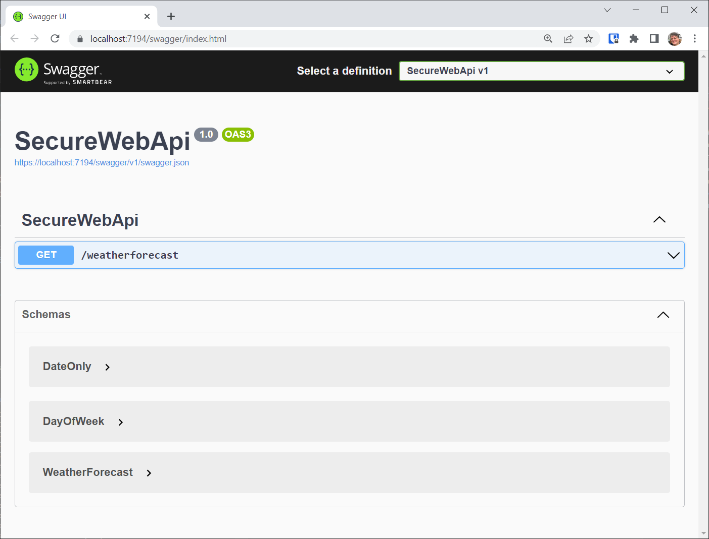

Expand `GET /weatherforecast`, click on `Try it out`, then on `Execute`.

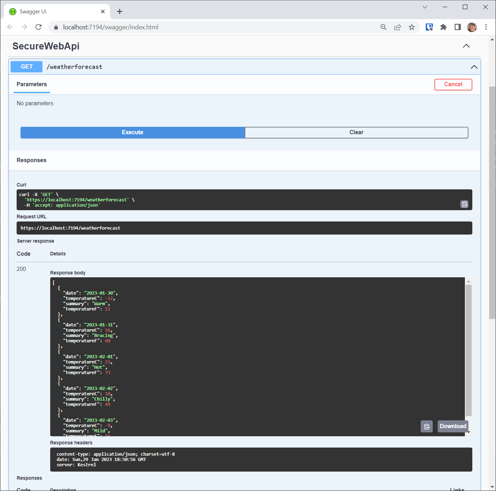  

We get data, so it is working, but it is not secure.

#### Secure the ASP.NET Core Web API

Let's make our `ASP.NET Core Web API` app secure.

Open the `Package Manager Console`:

  

And add the following `NuGet` packages:

- Microsoft.AspNetCore.Authentication.JwtBearer
- Microsoft.Identity.Web
- Microsoft.Identity.Web.MicrosoftGraph
- Microsoft.Identity.Web.UI

By running the following commands:

```powershell
install-package Microsoft.AspNetCore.Authentication.JwtBearer
install-package Microsoft.Identity.Web
install-package Microsoft.Identity.Web.MicrosoftGraph
install-package Microsoft.Identity.Web.UI
```

Your project file should look like this:

```xml
<Project Sdk="Microsoft.NET.Sdk.Web">

  <PropertyGroup>
    <TargetFramework>net7.0</TargetFramework>
    <Nullable>enable</Nullable>
    <ImplicitUsings>enable</ImplicitUsings>
  </PropertyGroup>

  <ItemGroup>
    <PackageReference Include="Microsoft.AspNetCore.Authentication.JwtBearer" Version="7.0.2" />
    <PackageReference Include="Microsoft.AspNetCore.OpenApi" Version="7.0.2" />
    <PackageReference Include="Microsoft.Identity.Web" Version="1.25.10" />
    <PackageReference Include="Microsoft.Identity.Web.MicrosoftGraph" Version="1.25.10" />
    <PackageReference Include="Microsoft.Identity.Web.UI" Version="1.25.10" />
    <PackageReference Include="Swashbuckle.AspNetCore" Version="6.4.0" />
  </ItemGroup>

</Project>
```

Open the *Program.cs* file and add the following using statements:

```csharp
using Microsoft.Identity.Web;
using Microsoft.AspNetCore.Authentication.JwtBearer;
```

Below `var builder = WebApplication.CreateBuilder(args);`, add the following code:

```csharp
builder.Services.AddAuthentication(JwtBearerDefaults.AuthenticationScheme)
    .AddMicrosoftIdentityWebApi(builder.Configuration.GetSection("AzureAd"))
        .EnableTokenAcquisitionToCallDownstreamApi()
            .AddMicrosoftGraph(builder.Configuration.GetSection("MicrosoftGraph"))
            .AddInMemoryTokenCaches()
            .AddDownstreamWebApi("DownstreamApi", builder.Configuration.GetSection("DownstreamApi"))
            .AddInMemoryTokenCaches();
builder.Services.AddAuthorization();
```

At the bottom, before `app.Run();` add the following two lines:

```csharp
app.UseAuthentication();
app.UseAuthorization();
```

And finally, in the `app.MapGet("/weatherforecast"` code, add the following line after `.WithName("GetWeatherForecast")`:

```csharp
.RequireAuthorization()
```

The complete *Program.cs* file should look like this now:

```csharp
using Microsoft.Identity.Web;
using Microsoft.AspNetCore.Authentication.JwtBearer;
var builder = WebApplication.CreateBuilder(args);

// Add services to the container.
builder.Services.AddAuthentication(JwtBearerDefaults.AuthenticationScheme)
    .AddMicrosoftIdentityWebApi(builder.Configuration.GetSection("AzureAd"))
        .EnableTokenAcquisitionToCallDownstreamApi()
            .AddMicrosoftGraph(builder.Configuration.GetSection("MicrosoftGraph"))
            .AddInMemoryTokenCaches()
            .AddDownstreamWebApi("DownstreamApi", builder.Configuration.GetSection("DownstreamApi"))
            .AddInMemoryTokenCaches();
builder.Services.AddAuthorization();

// Learn more about configuring Swagger/OpenAPI at https://aka.ms/aspnetcore/swashbuckle
builder.Services.AddEndpointsApiExplorer();
builder.Services.AddSwaggerGen();

var app = builder.Build();

// Configure the HTTP request pipeline.
if (app.Environment.IsDevelopment())
{
    app.UseSwagger();
    app.UseSwaggerUI();
}

app.UseHttpsRedirection();

var summaries = new[]
{
    "Freezing", "Bracing", "Chilly", "Cool", "Mild", "Warm", "Balmy", "Hot", "Sweltering", "Scorching"
};

app.MapGet("/weatherforecast", () =>
{
    var forecast = Enumerable.Range(1, 5).Select(index =>
        new WeatherForecast
        (
            DateOnly.FromDateTime(DateTime.Now.AddDays(index)),
            Random.Shared.Next(-20, 55),
            summaries[Random.Shared.Next(summaries.Length)]
        ))
        .ToArray();
    return forecast;
})
.WithName("GetWeatherForecast")
.WithOpenApi()
.RequireAuthorization();

app.UseAuthentication();
app.UseAuthorization();

app.Run();

internal record WeatherForecast(DateOnly Date, int TemperatureC, string? Summary)
{
    public int TemperatureF => 32 + (int)(TemperatureC / 0.5556);
}
```

The `ASP.NET Core Web API` app is secure now, but we need to add some IDs, and settings in the *appsettings.json* file.

Open the *appsettings.json* file, and add the following section above the `"Logging"` section:

```json
  "AzureAd": {
    "Instance": "https://login.microsoftonline.com/",
    "Domain": "REPLACE-WITH-YOUR-DOMAIN",
    "TenantId": "REPLACE-WITH-YOUR-TENANT-ID",
    "ClientId": "REPLACE-WITH-YOUR-CLIENT-ID",
    "CallbackPath": "/signin-oidc",
    "Scopes": "access_as_user",
    "ClientSecret": "REPLACE-WITH-YOUR-CLIENT-SECRET",
    "ClientCertificates": []
  },
```

#### Azure AD B2C App Registration

In order to get the settings required, we need to create an `Azure AD B2C` app registration.

Go to https://portal.azure.com and sign-in.

>:blue_book: If you do not have an Azure account, you can sign-up for free at https://azure.microsoft.com/en-us/free/.

Search for `Azure AD B2C`, and select it from the list:

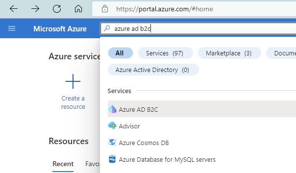  

Click on `App registrations`.

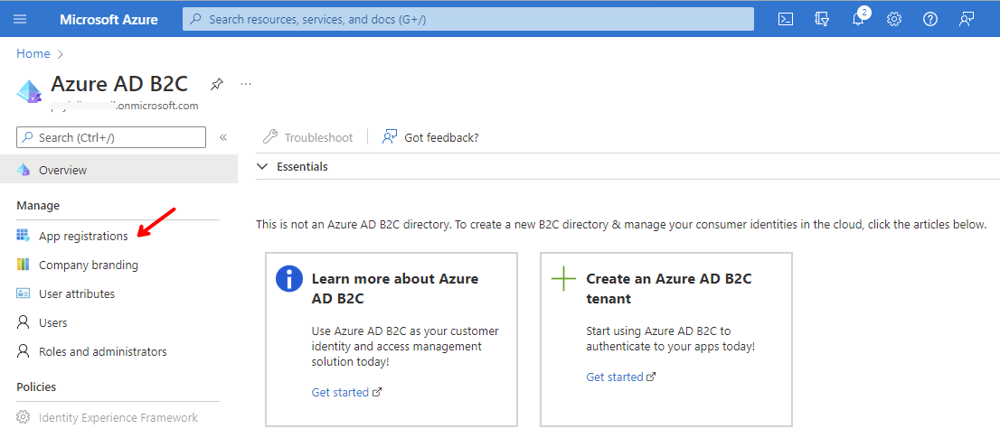  

Then click on `Add new registration`.

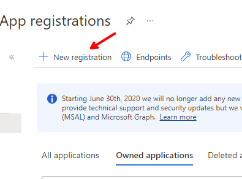  

Fill-out the following values and click `Register`.

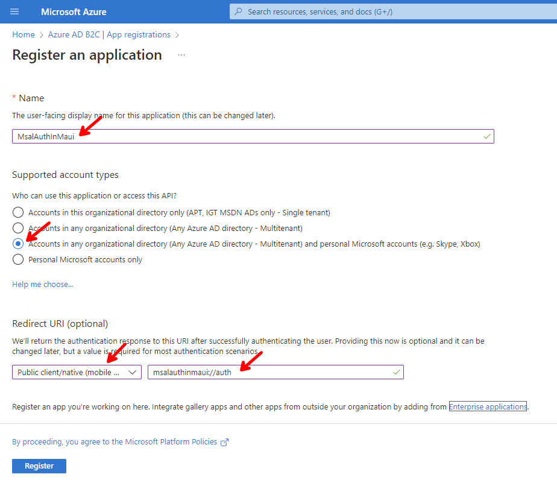  

You will be presented with the Overview page, which has useful information such as Application ID, and Tenant ID. There are also some valuable links to quick start guides. Feel free to look around.

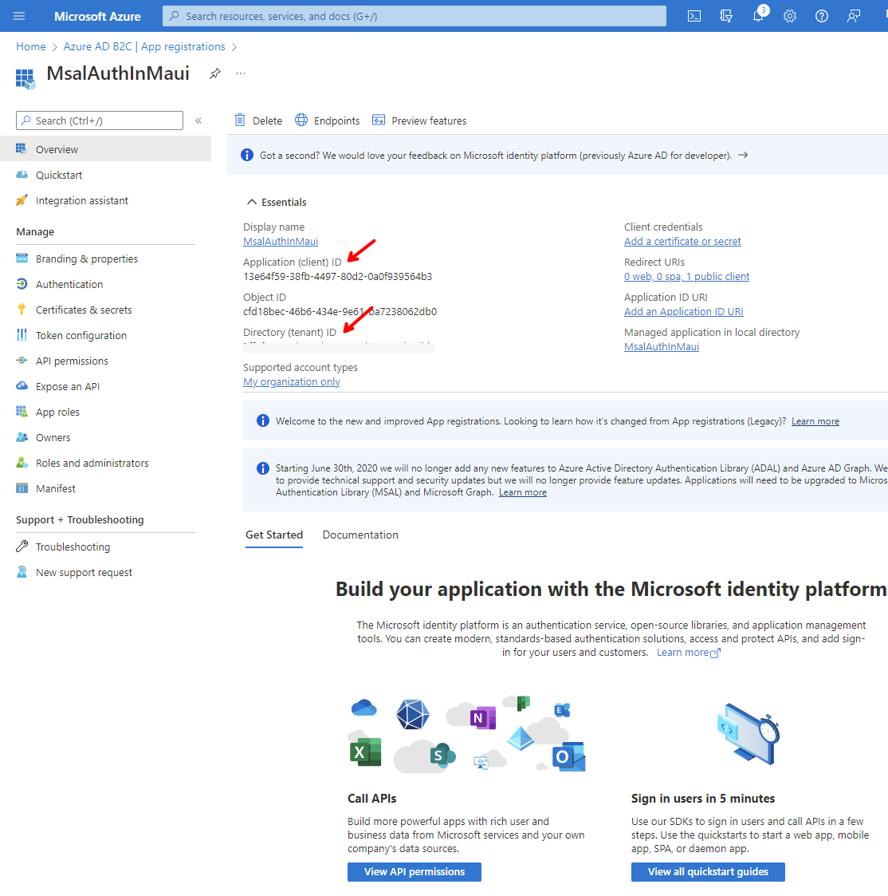  

Copy the `Application (client) ID` value, and use that to fill the `"ClientId"` setting, and then copy the `Directory (tenant) ID` value to fill the `"TenantId"` setting in the *appsettings.json* file.

For the `"Domain"`, go to `Branding & properties`, and copy the value under `Publisher domain`.

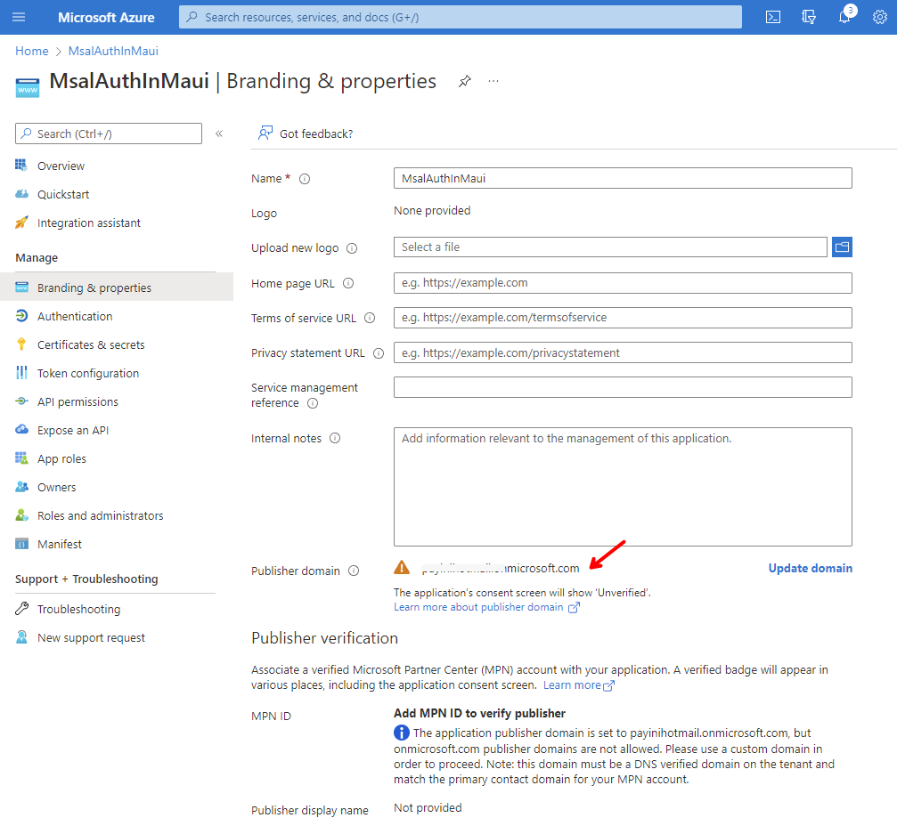  

Now, we need to create a client secret. Go to `Certificates & secrets`, then click on `+ New client secret`, give it a description, set an expiration option, and click on the `Add` button.

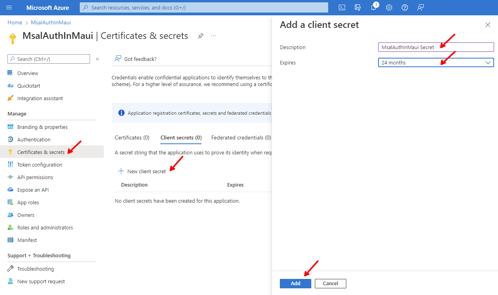  

This will generate a client secret. Copy the value, paste it under the `"ClientSecret"` setting in the *appsettings.json* file.

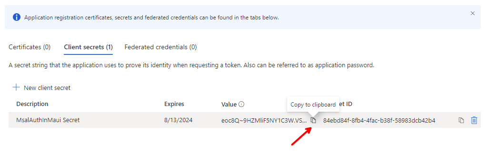  

>:warning: The client secret will only display at this moment; if you move to another screen, you will not be able to retrieve the value anymore. You may choose to store this value safely at this point in `Azure Key Vault`, or some other safe location. If you lose it, you will have to create a new client secret.

Set the `"Scopes"` value to `"access_as_user"`, which we are going to configure in `Azure AD B2C` in the [Configure Azure AD B2C Scope](#configure-azure-ad-b2c-scope) section, after we deploy our application to Azure.

Go to `Authentication`, and change the following settings:

Under, `Mobile and desktop applications`, check the `Redirect URIs` `https://login.microsoftonline.com/common/oauth2/nativeclient`, and `msalxxxxxxxx-xxxx-xxxx-xxxx-xxxxxxxxxxxx://auth`.

Then, under `Advanced settings` click `Yes` to allow `Client public flows`, next to `Enable the following mobile and desktop flows`.

Click on `Save`.

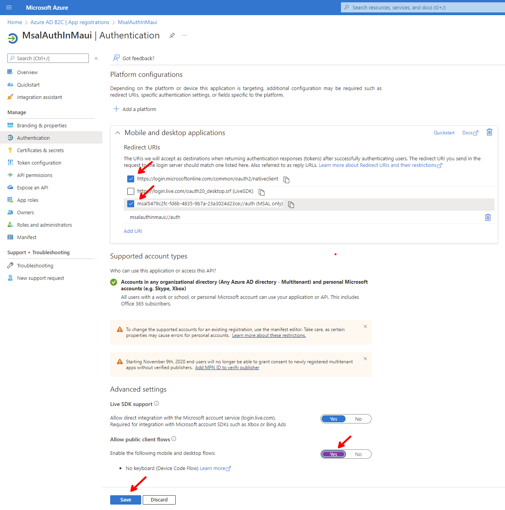  

The complete *appsettings.json* should look like this:

```json
{
  "AzureAd": {
    "Instance": "https://login.microsoftonline.com/",
    "Domain": "*********.onmicrosoft.com",
    "TenantId": "********-****-****-*****************",
    "ClientId": "********-****-****-*****************",
    "CallbackPath": "/signin-oidc",
    "Scopes": "access_as_user",
    "ClientSecret": "**************************************",
    "ClientCertificates": []
  },
  "Logging": {
    "LogLevel": {
      "Default": "Information",
      "Microsoft.AspNetCore": "Warning"
    }
  },
  "AllowedHosts": "*"
}
```

>:point_up: Some values were replaced with asterisks for security reasons.

Build and run the application, expand `GET /weatherforecast` again, click on `Try it out`, then on `Execute`.

This time, you should get an Unauthorized 401 HTTP code back.

  

Our Web API application is secure!

#### Deploy ASP.NET Core Web API to Azure

I'll show you how to do this from Visual Studio, but you can also create the Web App in Azure, download the publish profile, and then import it.

Right-click on the *SecureWebApi.csproj* file, and select `Publish...`, then follow the following steps:

  

  

  

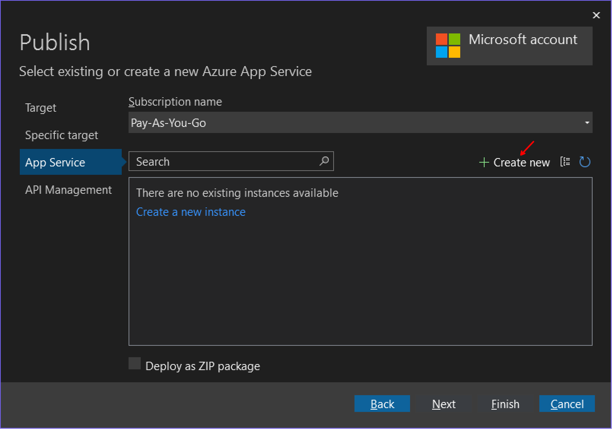  

Note: **MsalSecureWebApi** will not be available. Try appending a unique value to create a name such as **MsalSecureWebApi-CarlFranklin**

  

  

  

Make sure to select `Skip this step` for the API Management option.

  

  


After deployment, the application will launch but you will get a HTTP Error 404.

  

Worry not, this is because for security reason, Swagger is only enabled running in Development mode.

If you want to enable it for testing purposes, you can comment-out the `if (app.Environment.IsDevelopment())` condition in the *Program.cs* file.

```csharp
// Configure the HTTP request pipeline.
if (app.Environment.IsDevelopment())
{
    app.UseSwagger();
    app.UseSwaggerUI();
}
```

If you append `/weatherforecast` to the URL, you will see that indeed, the application is running, as the proper `Unauthorized 401` shows up, as we are not passing an access token.

  

#### Configure Azure AD B2C Scope

Now, we need to create our `access_as_user` scope we specified in the *appsettings.json* file.

Go back to the Azure portal, select `Expose an API`, then click on `+ Add a scope`, leave the default value for `Application ID URI`, and click `Save and continue`.

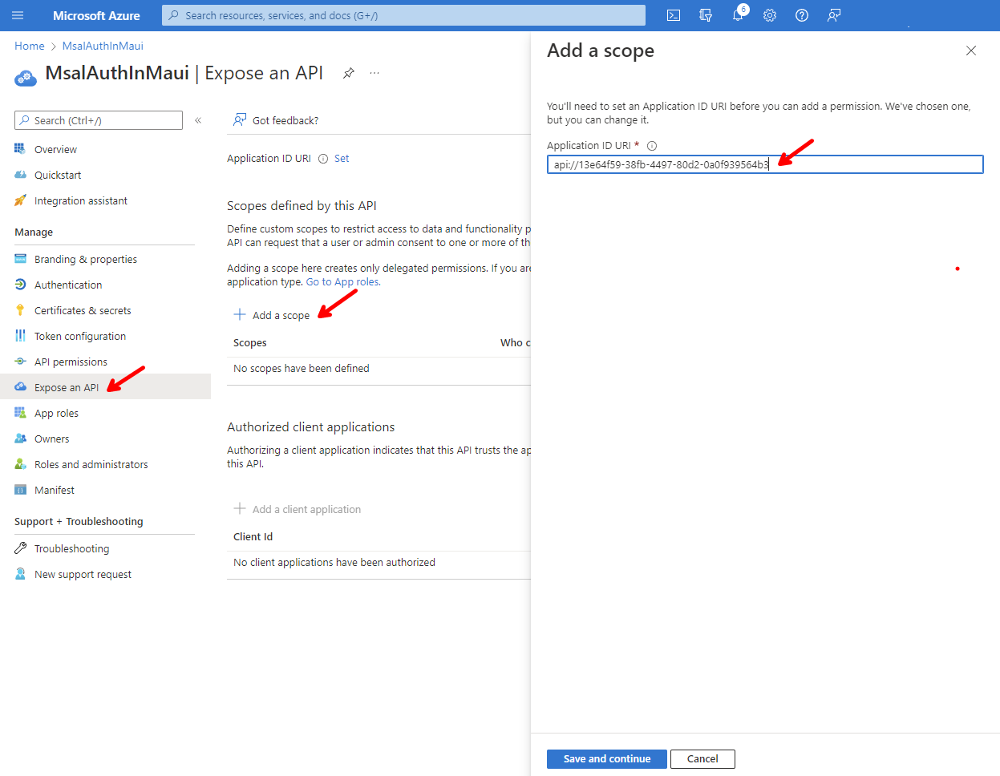

Fill-in the required values as shown below, and click on `Add scope`:

- access_as_user
- Sepecify Admins and users for "Who can consent?"
- Call the SecureWebApi on behalf of the user
- Allows the MsalAuthInMaui app to call the SecureWebApi on behalf of the user
- Call the SecureWebApi on your behalf
- Allows the MsalAuthInMaui app to call the SecureWebApi on your behalf

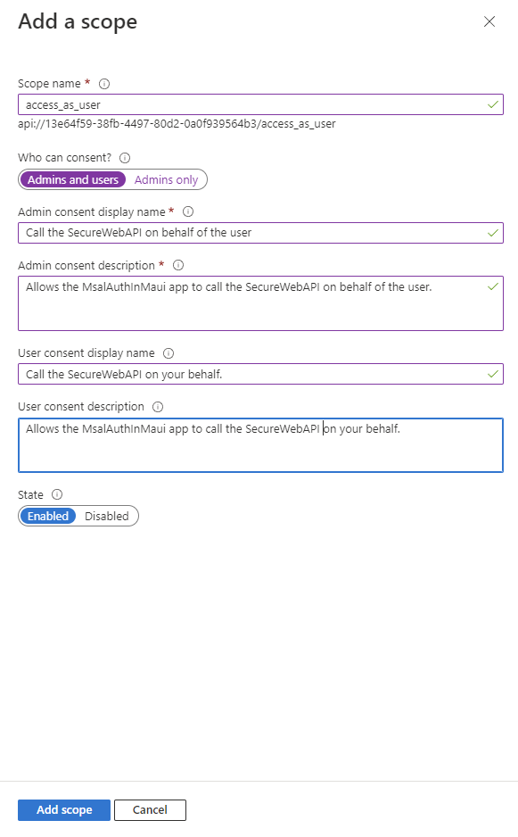

The `access_as_user` scope has been added.

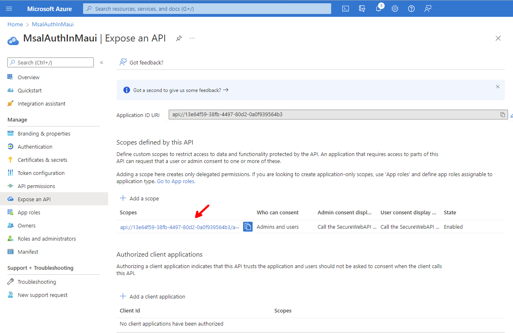  

#### Set API Permissions

Finally, we need to set the `API Permissions`, so our `MAUI` application can call the Web API with an access token, after authentication.

In order to do that, click on `API permissions`, then `+ Add a permission`. Select `My APIs`, and click on `MsalAuthInMaui`.

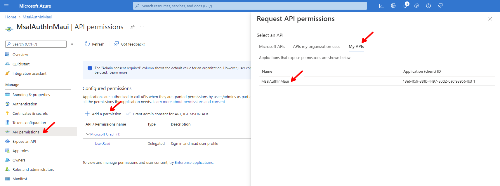  

Then keep the `Delegated permissions` selected, check the `access_as_user` permission, and click on `Add permissions`.

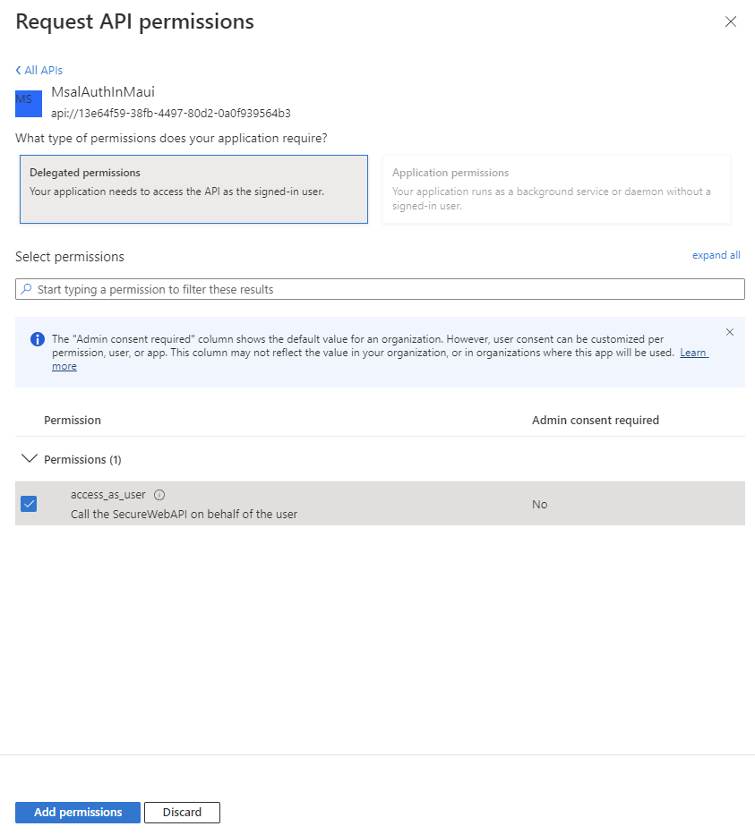

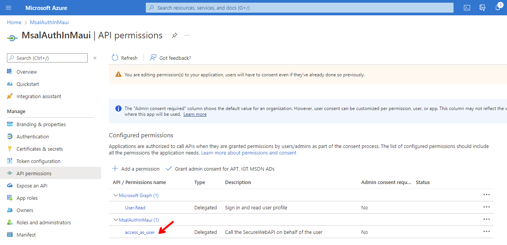  

 Click on the "Grant admin consent for xxxxx" link and then select Yes.

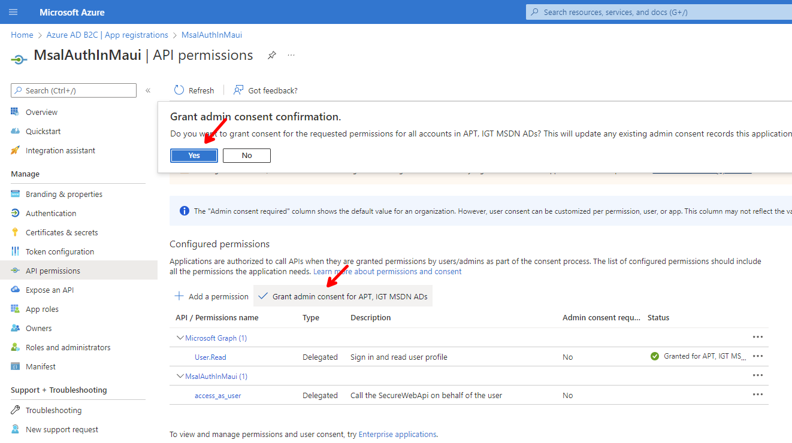  

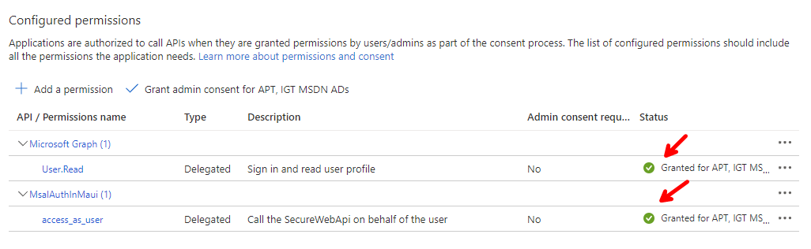   

### Create a `.NET MAUI` application

In this demo, we are going to create a `.NET MAUI` application, then we are going to configure the application, so users can authenticate to `Azure AD B2C` to get an access token. Finally we are going to call our secure `ASP.NET Core Web API` application from the `.NET MAUI` application by passing the access token.

Add a new `.NET MAUI app` project to the solution.

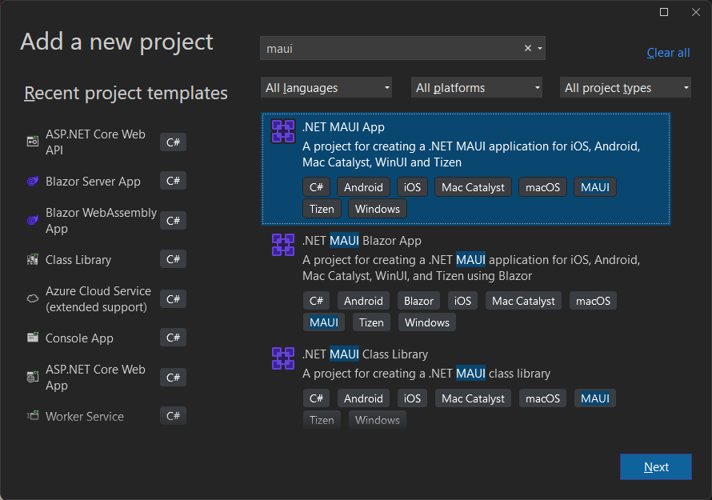  

Name it `MsalAuthInMaui`

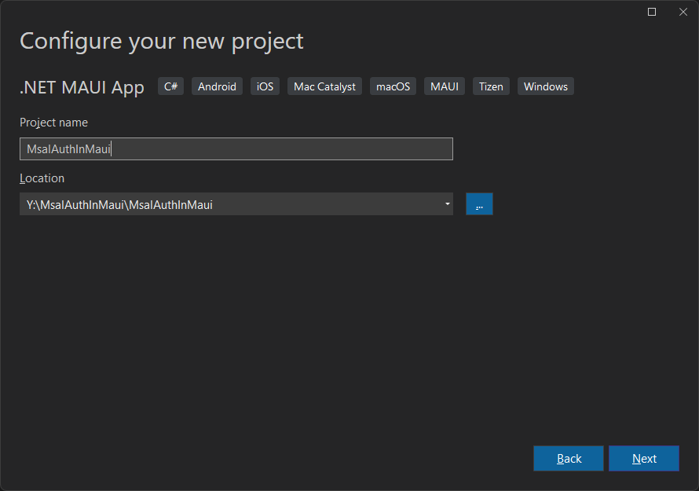  

 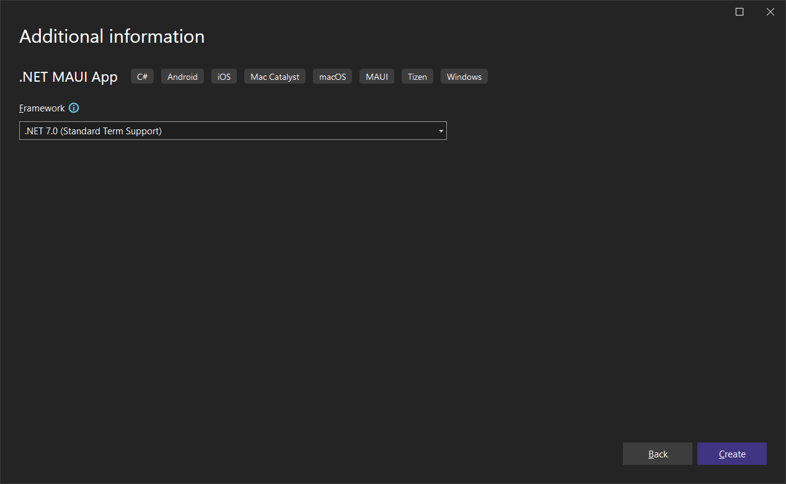

You might see this:

  

>:blue_book: Make sure you allow access in the `Windows Security Alert` as this is an important step to allow Visual Studio to communicate to your MAC to deploy to an iOS simulator.

Go to the *MainPage.xaml* and replace the `CounterBtn` code with this:

```xaml
<HorizontalStackLayout HorizontalOptions="Center">
    <Button x:Name="LoginButton"
            Text="Log in"
            SemanticProperties.Hint="Log in"
            Clicked="OnLoginButtonClicked"
            HorizontalOptions="Center"
            Margin="8,0,8,0" />

    <Button x:Name="LogoutButton"
            Text="Log out"
            SemanticProperties.Hint="Log out"
            Clicked="OnLogoutButtonClicked"
            HorizontalOptions="Center"
            Margin="8,0,8,0" />
</HorizontalStackLayout>
```

Right click on the `MsalAuthInMaui` project, and set it as the Startup project.

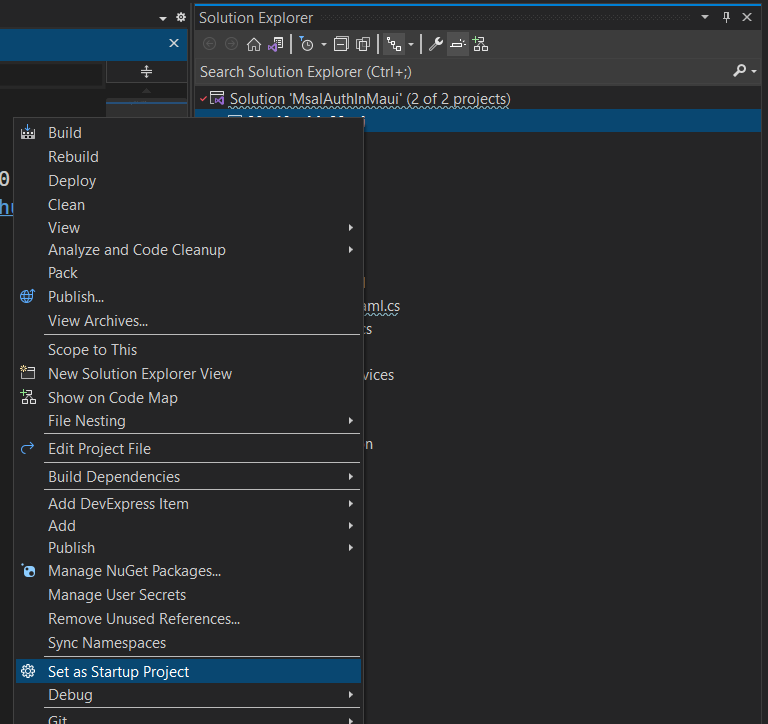  

### Configure our `.NET MAUI` application to use `MSAL.NET` to authenticate users and get an access token

`MSAL.NET` is part of the `Microsoft identity platform`, so let's add a reference to that.

Add a `NuGet` package reference for `Microsoft.Identity.Client` to your `MsalAuthInMaui` project by running the following command in `Package Manager Console`:

```powershell
install-package Microsoft.Identity.Client
```

>:blue_book: Make sure you have the `MsalAuthInMaui` project selected.

Create a *MsalClient* folder, and add the following two files:

#### PCAWrapper.cs

```csharp
// Copyright (c) Microsoft Corporation. All rights reserved.
// Licensed under the MIT License.

using Microsoft.Identity.Client;

namespace MsalAuthInMaui.MsalClient;

/// <summary>
/// This is a wrapper for PCA. It is singleton and can be utilized by both application and the MAM callback
/// </summary>
public class PCAWrapper
{
    /// <summary>
    /// This is the singleton used by consumers
    /// </summary>
    public static PCAWrapper Instance { get; private set; } = new PCAWrapper();

    internal IPublicClientApplication PCA { get; }

    internal bool UseEmbedded { get; set; } = false;

    internal const string ClientId = "[REPLACE WITH YOUR CLIENT ID]";
    internal const string TenantId = "[REPLACE WITH YOUR TENANT ID]";
    internal const string Authority = $"https://login.microsoftonline.com/{TenantId}";
    public static string[] Scopes = { $"api://{ClientId}/access_as_user" };

    // private constructor for singleton
    private PCAWrapper()
    {
        // Create PCA once. Make sure that all the config parameters below are passed
        PCA = PublicClientApplicationBuilder
                                    .Create(ClientId)
                                    .WithRedirectUri(PlatformConfig.Instance.RedirectUri)
                                    .WithIosKeychainSecurityGroup("com.microsoft.adalcache")
                                    .Build();
    }

    /// <summary>
    /// Acquire the token silently
    /// </summary>
    /// <param name="scopes">desired scopes</param>
    /// <returns>Authentication result</returns>
    public async Task<AuthenticationResult> AcquireTokenSilentAsync(string[] scopes)
    {
        var accts = await PCA.GetAccountsAsync().ConfigureAwait(false);
        var acct = accts.FirstOrDefault();

        var authResult = await PCA.AcquireTokenSilent(scopes, acct)
                                    .ExecuteAsync().ConfigureAwait(false);
        return authResult;

    }

    /// <summary>
    /// Perform the interactive acquisition of the token for the given scope
    /// </summary>
    /// <param name="scopes">desired scopes</param>
    /// <returns></returns>
    internal async Task<AuthenticationResult> AcquireTokenInteractiveAsync(string[] scopes)
    {

#if IOS
		// Hide the privacy prompt in iOS
		var systemWebViewOptions = new SystemWebViewOptions();
        systemWebViewOptions.iOSHidePrivacyPrompt = true;

        return await PCA.AcquireTokenInteractive(scopes)
                                .WithAuthority(Authority)
								.WithTenantId(TenantId)
                                .WithParentActivityOrWindow(PlatformConfig.Instance.ParentWindow)
								.WithUseEmbeddedWebView(UseEmbedded)
								.WithSystemWebViewOptions(systemWebViewOptions)
                                .ExecuteAsync()
                                .ConfigureAwait(false);
#elif ANDROID
        return await PCA.AcquireTokenInteractive(scopes)
                                .WithAuthority(Authority)
                                .WithTenantId(TenantId)
                                .WithParentActivityOrWindow(PlatformConfig.Instance.ParentWindow)
                                .WithUseEmbeddedWebView(true)
                                .ExecuteAsync()
                                .ConfigureAwait(false);
#endif

        throw new Exception("Platform not supported.");
    }

    /// <summary>
    /// Signout may not perform the complete signout as company portal may hold
    /// the token.
    /// </summary>
    /// <returns></returns>
    internal async Task SignOutAsync()
    {
        var accounts = await PCA.GetAccountsAsync().ConfigureAwait(false);
        foreach (var acct in accounts)
        {
            await PCA.RemoveAsync(acct).ConfigureAwait(false);
        }
    }
}
```

>:point_up: Replace Authority, ClientId, TenantId, and Scopes with your values from the Azure AD B2C app registration.

>:blue_book: `.WithSystemWebViewOptions(systemWebViewOptions)` in `AcquireTokenInteractive` call, is used to avoid a privacy prompt pop-up, as seen in the screen below.

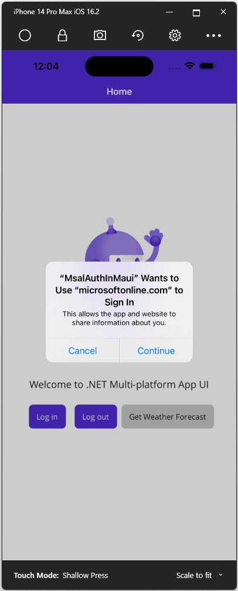

#### PlatformConfig.cs

```csharp
// Copyright (c) Microsoft Corporation. All rights reserved.
// Licensed under the MIT License.

namespace MsalAuthInMaui.MsalClient;

/// <summary>
/// Platform specific configuration.
/// </summary>
public class PlatformConfig
{
    /// <summary>
    /// Instance to store data
    /// </summary>
    public static PlatformConfig Instance { get; } = new PlatformConfig();

    /// <summary>
    /// Platform specific Redirect URI
    /// </summary>
    public string RedirectUri { get; set; }

    /// <summary>
    /// Platform specific parent window
    /// </summary>
    public object ParentWindow { get; set; }

    // private constructor to ensure singleton
    private PlatformConfig()
    {
    }
}
```

>:point_up: The `MsalClient` code, is based on the [Microsoft Authentication Library (MSAL) for .NET, UWP, NetCore, Xamarin Android and iOS](https://github.com/AzureAD/microsoft-authentication-library-for-dotnet) repo.

Open the *MainPage.xaml.cs* file, and replace the code with the following:

```csharp
using Microsoft.Identity.Client;
using MsalAuthInMaui.MsalClient;

namespace MsalAuthInMaui;

public partial class MainPage : ContentPage
{
    private string _accessToken = string.Empty;

    public MainPage()
    {
        InitializeComponent();
    }

    private async void OnLoginButtonClicked(object sender, EventArgs e)
    {
        await Login().ConfigureAwait(false);
    }

    private async Task Login()
    {
        try
        {
            // Attempt silent login, and obtain access token.
            var result = await PCAWrapper.Instance.AcquireTokenSilentAsync(PCAWrapper.Scopes).ConfigureAwait(false);

            // Set access token.
            _accessToken = result.AccessToken;

            // Display Access Token from AcquireTokenSilentAsync call.
            await ShowOkMessage("Access Token from AcquireTokenSilentAsync call", _accessToken).ConfigureAwait(false);
        }
        // A MsalUiRequiredException will be thrown, if this is the first attempt to login, or after logging out.
        catch (MsalUiRequiredException)
        {
            // Perform interactive login, and obtain access token.
            var result = await PCAWrapper.Instance.AcquireTokenInteractiveAsync(PCAWrapper.Scopes).ConfigureAwait(false);

            // Set access token.
            _accessToken = result.AccessToken;

            // Display Access Token from AcquireTokenInteractiveAsync call.
            await ShowOkMessage("Access Token from AcquireTokenInteractiveAsync call", _accessToken).ConfigureAwait(false);
        }
        catch (Exception ex)
        {
            await ShowOkMessage("Exception in AcquireTokenSilentAsync", ex.Message).ConfigureAwait(false);
        }
    }

    private async void OnLogoutButtonClicked(object sender, EventArgs e)
    {
        // Log out.
        _ = await PCAWrapper.Instance.SignOutAsync().ContinueWith(async (t) =>
        {
            await ShowOkMessage("Signed Out", "Sign out complete.").ConfigureAwait(false);
            _accessToken = string.Empty;
        }).ConfigureAwait(false);
    }

    private Task ShowOkMessage(string title, string message)
    {
        _ = Dispatcher.Dispatch(async () =>
        {
            await DisplayAlert(title, message, "OK").ConfigureAwait(false);
        });
        return Task.CompletedTask;
    }
}
```

### Running on Android

I'm going to use an Android emulator. If you have an Android phone connected to your machine, you can use that instead. In either case, the configuration and code will not have to change.

Change your deployment setting from `Windows Machine` to an `Android Emulator` option, that you may have already setup. In my case, I will select `Pixel XL - API 31 (Android 12.0 - API 31). 

  

>:blue_book: Creating Android emulators or iOS Simulators is out-of-scope for this demo.

Open the *AndroidManifest.xml* file, under *Platforms/Android*, and replace the code with this:

```xml
<?xml version="1.0" encoding="utf-8"?>
<manifest xmlns:android="http://schemas.android.com/apk/res/android">
	<application android:allowBackup="true" android:icon="@mipmap/appicon" android:roundIcon="@mipmap/appicon_round" android:supportsRtl="true"></application>
	<uses-permission android:name="android.permission.ACCESS_NETWORK_STATE" />
	<uses-permission android:name="android.permission.INTERNET" />
	<queries>
		<package android:name="com.azure.authenticator" />
		<package android:name="UserDetailsClient.Droid" />
		<package android:name="com.microsoft.windowsintune.companyportal" />
		<!-- Required for API Level 30 to make sure we can detect browsers
		(that don't support custom tabs) -->
		<intent>
			<action android:name="android.intent.action.VIEW" />
			<category android:name="android.intent.category.BROWSABLE" />
			<data android:scheme="https" />
		</intent>
		<!-- Required for API Level 30 to make sure we can detect browsers that support custom tabs -->
		<!-- https://developers.google.com/web/updates/2020/07/custom-tabs-android-11#detecting_browsers_that_support_custom_tabs -->
		<intent>
			<action android:name="android.support.customtabs.action.CustomTabsService" />
		</intent>
	</queries>
	<uses-sdk android:minSdkVersion="21" />
</manifest>
```

Finally, open *MainActivity.cs*, also under *Platforms/Android*, and replace the code with this:

```csharp
using Android.App;
using Android.Content;
using Android.Content.PM;
using Android.OS;
using Android.Runtime;
using Microsoft.Identity.Client;
using MsalAuthInMaui.MsalClient;

namespace MsalAuthInMaui
{
    [Activity(Theme = "@style/Maui.SplashTheme", MainLauncher = true, ConfigurationChanges = ConfigChanges.ScreenSize | ConfigChanges.Orientation | ConfigChanges.UiMode | ConfigChanges.ScreenLayout | ConfigChanges.SmallestScreenSize | ConfigChanges.Density)]
    public class MainActivity : MauiAppCompatActivity
    {
        private const string AndroidRedirectURI = $"msauth://com.companyname.msalauthinmaui/snaHlgr4autPsfVDSBVaLpQXnqU=";

        protected override void OnCreate(Bundle savedInstanceState)
        {
            base.OnCreate(savedInstanceState);

            // Configure platform specific parameters
            PlatformConfig.Instance.RedirectUri = AndroidRedirectURI;
            PlatformConfig.Instance.ParentWindow = this;
        }

        /// <summary>
        /// This is a callback to continue with the authentication
        /// Info about redirect URI: https://docs.microsoft.com/en-us/azure/active-directory/develop/msal-client-application-configuration#redirect-uri
        /// </summary>
        /// <param name="requestCode">request code </param>
        /// <param name="resultCode">result code</param>
        /// <param name="data">intent of the actvity</param>
        protected override void OnActivityResult(int requestCode, [GeneratedEnum] Result resultCode, Intent data)
        {
            base.OnActivityResult(requestCode, resultCode, data);
            AuthenticationContinuationHelper.SetAuthenticationContinuationEventArgs(requestCode, resultCode, data);
        }
    }
}
```

Now, go back to Azure, and under Authentication click `+ Add a platform`.

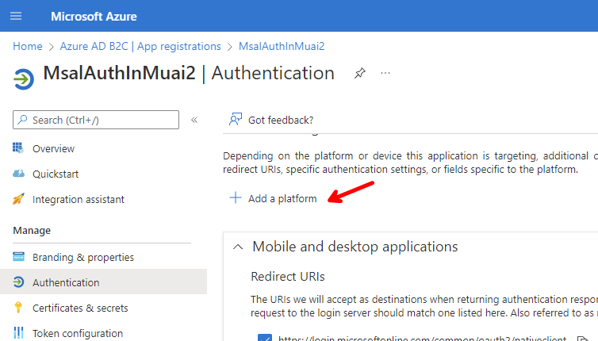

Click on Web.

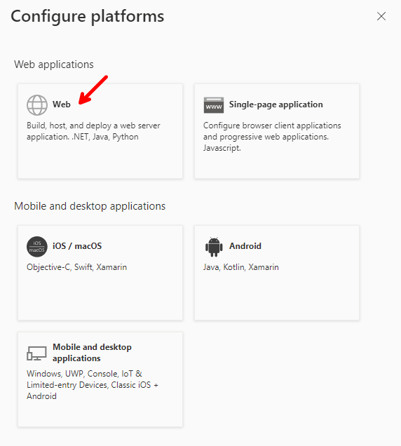  

Type `https://msalsecurewebapi.azurewebsites.net/signin-oidc` for the Redirect URI, check Access tokens, and ID tokens, and click on Configure.

> :point_up: Change `msalsecurewebapi` to your secure server app name.

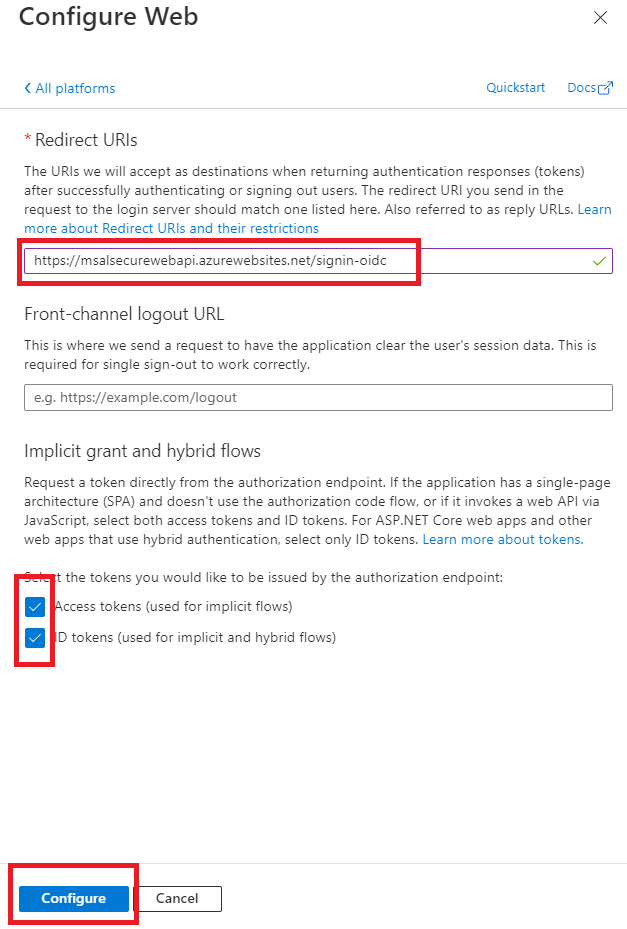  

The new Web platform will show up with your selections.

Next, add the URL from *MainActivity.cs* line 14 to the **Mobile and desktop applications** section. 

```
msauth://com.companyname.msalauthinmaui/snaHlgr4autPsfVDSBVaLpQXnqU=
```

Select both checkboxes and press **Save**.

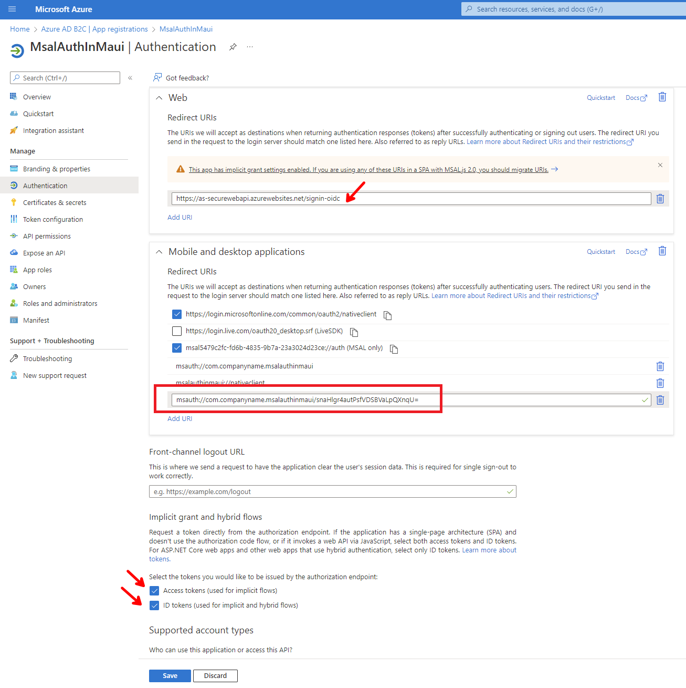  

And that is all! Run the app, and you should be able to log in, see the access token retrieved, as well as log out.

>:blue_book: Notice, that you will get some prompts to accept Chrome conditions, turn on sync, multi-factor authentication if you have it setup, accept the app conditions (the ones we setup when we created the `access_as_user` scope,) etc.

|                                                    |                                                    |                                                    |
| -------------------------------------------------- | -------------------------------------------------- | -------------------------------------------------- |
|  | 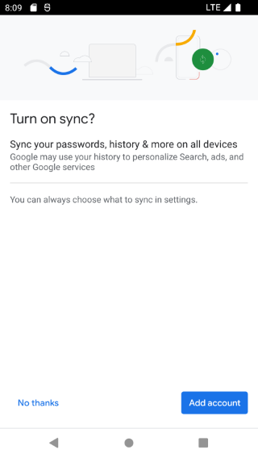 | 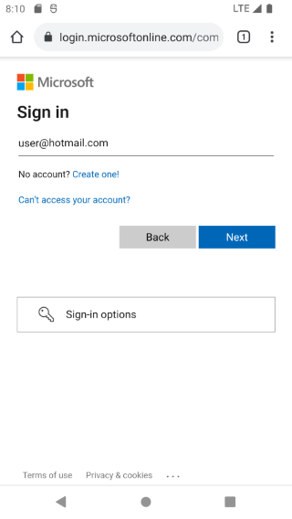 |
| 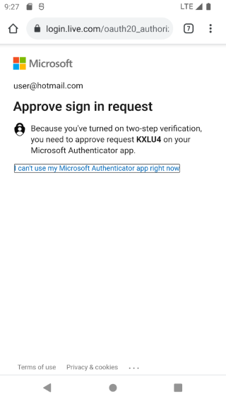 | 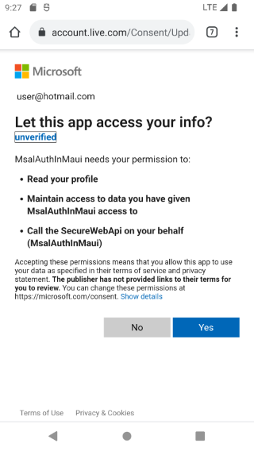 | 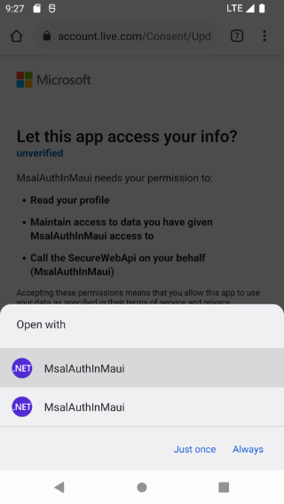 |

Finally, the access token:

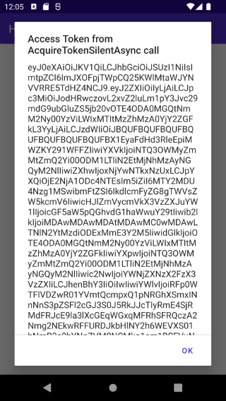

  

#### Call our secure `ASP.NET Core Web API` application from our `.NET MAUI` application

For the end of this demo, and now that we have an access token, let's call our secure Web API.

Let's add a `Get Weather Forecast` button.

Open *MainPage.xaml*, and add the button below the `HorizontalStackLayout` containing the `Login` and `Logout` buttons:

```xaml
<Button x:Name="GetWeatherForecastButton"
					Text="Get Weather Forecast"
					SemanticProperties.Hint="Get weather forecast data"
					Clicked="OnGetWeatherForecastButtonClicked"
					HorizontalOptions="Center"
					IsEnabled="{Binding IsLoggedIn}"/>
```

Update the *MainPage.xaml.cs* file with the following code:

```csharp
using Microsoft.Identity.Client;
using MsalAuthInMaui.MsalClient;

namespace MsalAuthInMaui;

public partial class MainPage : ContentPage
{
    private string _accessToken = string.Empty;

    bool _isLoggedIn = false;
    public bool IsLoggedIn
    {
        get => _isLoggedIn;
        set
        {
            if (value == _isLoggedIn) return;
            _isLoggedIn = value;
            OnPropertyChanged(nameof(IsLoggedIn));
        }
    }

    public MainPage()
    {
        BindingContext = this;
        InitializeComponent();
        _ = Login();
    }

    private async void OnLoginButtonClicked(object sender, EventArgs e)
    {
        await Login().ConfigureAwait(false);
    }

    private async Task Login()
    {
        try
        {
            // Attempt silent login, and obtain access token.
            var result = await PCAWrapper.Instance.AcquireTokenSilentAsync(PCAWrapper.Scopes).ConfigureAwait(false);
            IsLoggedIn = true;

            // Set access token.
            _accessToken = result.AccessToken;

            // Display Access Token from AcquireTokenSilentAsync call.
            await ShowOkMessage("Access Token from AcquireTokenSilentAsync call", _accessToken).ConfigureAwait(false);
        }
        // A MsalUiRequiredException will be thrown, if this is the first attempt to login, or after logging out.
        catch (MsalUiRequiredException)
        {
            // Perform interactive login, and obtain access token.
            var result = await PCAWrapper.Instance.AcquireTokenInteractiveAsync(PCAWrapper.Scopes).ConfigureAwait(false);
            IsLoggedIn = true;

            // Set access token.
            _accessToken = result.AccessToken;

            // Display Access Token from AcquireTokenInteractiveAsync call.
            await ShowOkMessage("Access Token from AcquireTokenInteractiveAsync call", _accessToken).ConfigureAwait(false);
        }
        catch (Exception ex)
        {
            IsLoggedIn = false;
            await ShowOkMessage("Exception in AcquireTokenSilentAsync", ex.Message).ConfigureAwait(false);
        }
    }

    private async void OnLogoutButtonClicked(object sender, EventArgs e)
    {
        // Log out.
        _ = await PCAWrapper.Instance.SignOutAsync().ContinueWith(async (t) =>
        {
            await ShowOkMessage("Signed Out", "Sign out complete.").ConfigureAwait(false);
            IsLoggedIn = false;
            _accessToken = string.Empty;
        }).ConfigureAwait(false);
    }

    private async void OnGetWeatherForecastButtonClicked(object sender, EventArgs e)
    {
        // Call the Secure Web API to get the weatherforecast data.
        var weatherForecastData = await CallSecureWebApi(_accessToken).ConfigureAwait(false);

        // Show the data.
        if (weatherForecastData != string.Empty)
            await ShowOkMessage("WeatherForecast data", weatherForecastData).ConfigureAwait(false);
    }

    // Call the Secure Web API.
    private static async Task<string> CallSecureWebApi(string accessToken)
    {
        if (accessToken == string.Empty)
            return string.Empty;

        try
        {
            // Get the weather forecast data from the Secure Web API.
            var client = new HttpClient();

            // Create the request.
            var message = new HttpRequestMessage(HttpMethod.Get, "https://msalsecurewebapi.azurewebsites.net/weatherforecast");

            // Add the Authorization Bearer header.
            message.Headers.Add("Authorization", $"Bearer {accessToken}");

            // Send the request.
            var response = await client.SendAsync(message).ConfigureAwait(false);

            // Get the response.
            var responseString = await response.Content.ReadAsStringAsync().ConfigureAwait(false);

            // Return the response.
            return responseString;
        }
        catch (Exception ex)
        {
            return ex.ToString();
        }
    }

    private Task ShowOkMessage(string title, string message)
    {
        _ = Dispatcher.Dispatch(async () =>
        {
            await DisplayAlert(title, message, "OK").ConfigureAwait(false);
        });
        return Task.CompletedTask;
    }
}
```

:point_up: Change `msalsecurewebapi` in the URL on line 101 to your secure server app name.

Let's run the app one more time, and if you are already logged in, it should log you in silently automatically as soon as you open the app, and the access token should be display.

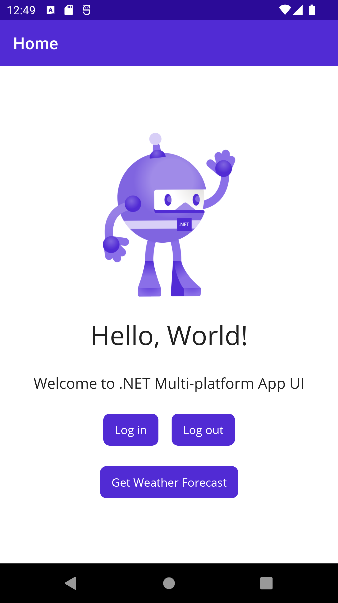

Then click the `Get Weather Forecast` button, and you should be able to call our Secure Web API, and the data should display:

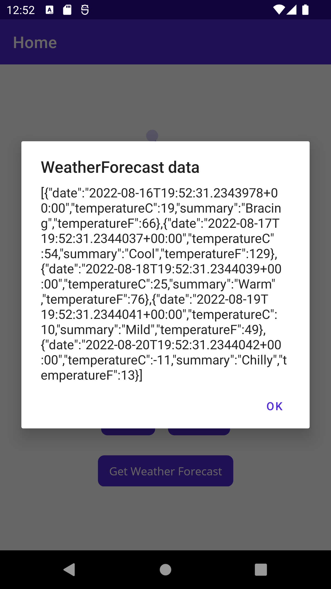  

### Running on iOS

#### Apple Developer Account

If you do not have an **Apple Developer** account, you can create one at [Apple's Developer Portal](https://developer.apple.com/).

> ☝️ Optional if you deploy to an iOS Local Device.

Now you need to override the `OpenUrl` method of the `MauiUIApplicationDelegate` derived class and call the `AuthenticationContinuationHelper.SetAuthenticationContinuationEventArgs` which comes with the `Microsoft.Identity.Client` library.

`SetAuthenticationContinuationEventArgs` handles the return from an interactive sign-in when using **MSAL**.

>:point_up: If `AuthenticationContinuationHelper.SetAuthenticationContinuationEventArgs` is not recognized, you need to use the latest version of the `Microsoft.Identity.Client` **NuGet** package, 4.49.1 at the time of this demo.

Modify the *AppDelegate.cs* file under the *Platforms\iOS* folder, to override the `OpenUrl` method with the following code:

```csharp
using Foundation;
using Microsoft.Identity.Client;
using UIKit;

namespace MsalAuthInMaui
{
	[Register("AppDelegate")]
	public class AppDelegate : MauiUIApplicationDelegate
	{
		protected override MauiApp CreateMauiApp() => MauiProgram.CreateMauiApp();

		public override bool OpenUrl(UIApplication app, NSUrl url, NSDictionary options)
		{
			AuthenticationContinuationHelper.SetAuthenticationContinuationEventArgs(url);
			return true;
		}
	}
}
```

>:blue_book: For more information about using MAUI iOS with MSAL.NET go to [Considerations for using Xamarin iOS with MSAL.NET](https://learn.microsoft.com/en-us/azure/active-directory/develop/msal-net-xamarin-ios-considerations)

iOS and macOS use special metadata, within apps and bundles, to enhance the user experience. This metadata serves various purposes, including displaying information to the user, identifying the app and document types it supports, and assisting in app launch through system frameworks.

The app's metadata is supplied to the system through an information property list file, commonly referred to as an *Info.plist* which, in a **MAUI** app, you can find under the *Platforms\iOS* folder.

We need to define a URL scheme to support **MSAL** authentication, by adding a **CFBundleURLTypes** key in *Info.plist*.

Right-click on *Info.plist* and select **Open With...**, then select **XML (Text) Editor**

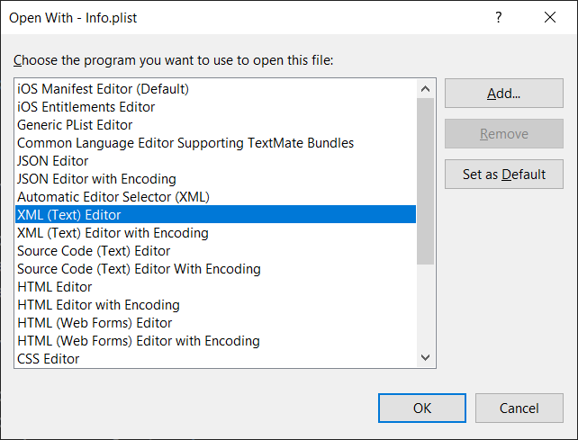

Add the following section, to *Info.plist*, under the *Platforms\iOS* folder, below `<string>Assets.xcassets/appicon.appiconset</string>`:

```xml
<key>CFBundleURLTypes</key>
<array>
    <dict>
        <key>CFBundleTypeRole</key>
        <string>Editor</string>
        <key>CFBundleURLName</key>
        <string>com.companyname.msalauthinmaui</string>
        <key>CFBundleURLSchemes</key>
        <array>
            <string>msal<REPLACE_WITH_YOUR_CLIENT_ID></string>
        </array>
    </dict>
</array>
```

> ☝️ CFBundleURLTypes is used to define a list of URL schemes supported by the app, in this case msal<REPLACE_WITH_YOUR_CLIENT_ID>

>:blue_book: For more information about *Info.plist* files go to [About Info.plist Keys and Values](https://developer.apple.com/library/archive/documentation/General/Reference/InfoPlistKeyReference/Introduction/Introduction.html).

The complete *Info.plist* file should look like this:

```xml
<?xml version="1.0" encoding="UTF-8"?>
<!DOCTYPE plist PUBLIC "-//Apple//DTD PLIST 1.0//EN" "http://www.apple.com/DTDs/PropertyList-1.0.dtd">
<plist version="1.0">
<dict>
	<key>LSRequiresIPhoneOS</key>
	<true/>
	<key>UIDeviceFamily</key>
	<array>
		<integer>1</integer>
		<integer>2</integer>
	</array>
	<key>UIRequiredDeviceCapabilities</key>
	<array>
		<string>arm64</string>
	</array>
	<key>UISupportedInterfaceOrientations</key>
	<array>
		<string>UIInterfaceOrientationPortrait</string>
		<string>UIInterfaceOrientationLandscapeLeft</string>
		<string>UIInterfaceOrientationLandscapeRight</string>
	</array>
	<key>UISupportedInterfaceOrientations~ipad</key>
	<array>
		<string>UIInterfaceOrientationPortrait</string>
		<string>UIInterfaceOrientationPortraitUpsideDown</string>
		<string>UIInterfaceOrientationLandscapeLeft</string>
		<string>UIInterfaceOrientationLandscapeRight</string>
	</array>
	<key>XSAppIconAssets</key>
	<string>Assets.xcassets/appicon.appiconset</string>
	<key>CFBundleURLTypes</key>
	<array>
		<dict>
			<key>CFBundleTypeRole</key>
			<string>Editor</string>
			<key>CFBundleURLName</key>
			<string>com.companyname.msalauthinmaui</string>
			<key>CFBundleURLSchemes</key>
			<array>
				<string>
					msal<REPLACE_WITH_YOUR_CLIENT_ID>
				</string>
			</array>
		</dict>
	</array>
</dict>
</plist>
```

> ☝️ Make sure, you replace <REPLACE_WITH_YOUR_CLIENT_ID> with your Client ID.

iOS uses a sandbox environment to limit access between **MAUI** apps and system resources or user data. To grant additional capabilities to the app, such as integration with **keychain**, entitlements can be requested through the app's *Entitlements.plist* file.

Since any entitlements utilized by the app must be defined within the *Entitlements.plist* file, we need to define a new entitlement to specify that we want to allow **MSAL** to be able to cache the authentication in **keychain**.

Add a new **.plist** file called *Entitlements.plist*, also under the *Platforms\iOS* folder, with the following content:

```xml
<?xml version="1.0" encoding="UTF-8"?>
<!DOCTYPE plist PUBLIC "-//Apple//DTD PLIST 1.0//EN" "http://www.apple.com/DTDs/PropertyList-1.0.dtd">
<plist version="1.0">
<dict>
	<key>keychain-access-groups</key>
	<array>
		<string>$(AppIdentifierPrefix)com.microsoft.adalcache</string>
	</array>
</dict>
</plist>
```

> ☝️ MSAL utilizes keychain caching when signing in users or refreshing tokens. This enables MSAL to offer silent sign-in among various apps that are developed by the same Apple developer.

>:blue_book: For more information about entitlements in **MAUI** go to [Entitlements](https://learn.microsoft.com/en-us/dotnet/maui/ios/entitlements?view=net-maui-7.0&tabs=vs).

And that should be it. Let's test the application now.

**iOS Local Device**

If this is the first time you try to run an application in an **iOS Local Device**, after you build the application you may get the following configuration screens:

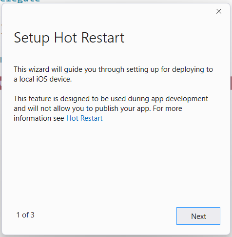

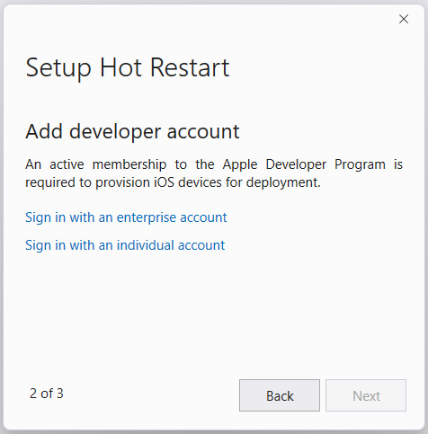

Click on either **Sign in with an enterprise account**, or **Sign in with an individual account**, depending on your **Apple Developer** account type.

You will get redirected to authenticate to https://appstoreconnect.apple.com/.

Once you authenticate, you'll be presented to the **Select a team** screen, where you'll select your team and click on **Finish**.

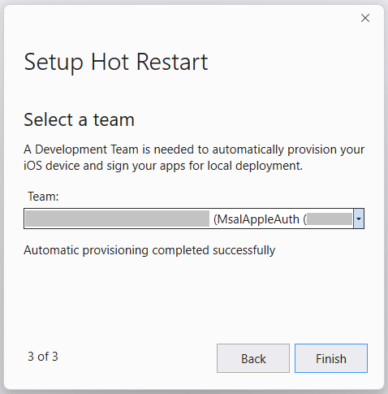

For more information about how to set up **API Keys** to connect to your **Apple Developer** account from **Visual Studio** go to [Creating API Keys for App Store Connect API](https://developer.apple.com/documentation/appstoreconnectapi/creating_api_keys_for_app_store_connect_api).

**iOS Simulators**

After you connect **Visual Studio** to a **MacOS** computer, select an **iOS Simulator** or your choice.

Run the application, and you will be presented to the following screens:

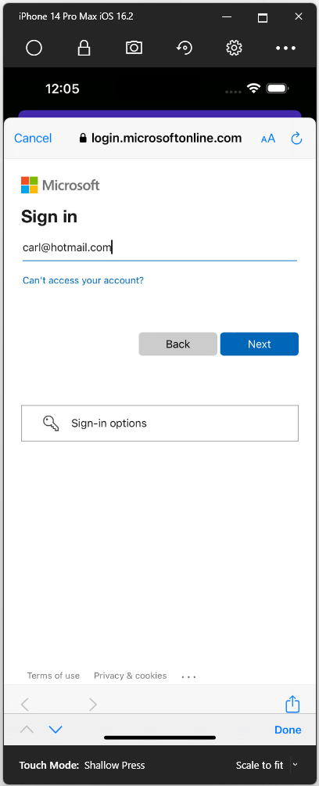

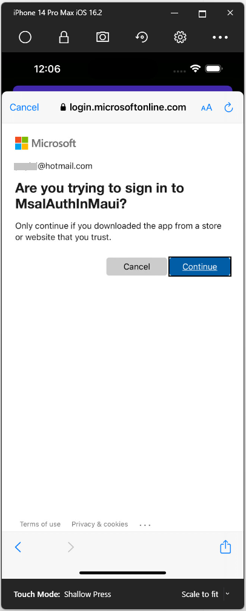

Once you go to the authentication process, you will be presented to a screen displaying the **Access Token** retrieved after successful authentication.

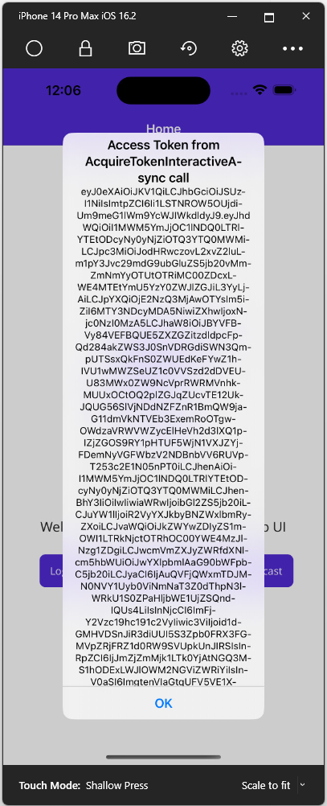

Now, the **Weather Forecast** button will be enabled, and after clicking it, you should get the weather forecast data successfully retrieved from our secure API.

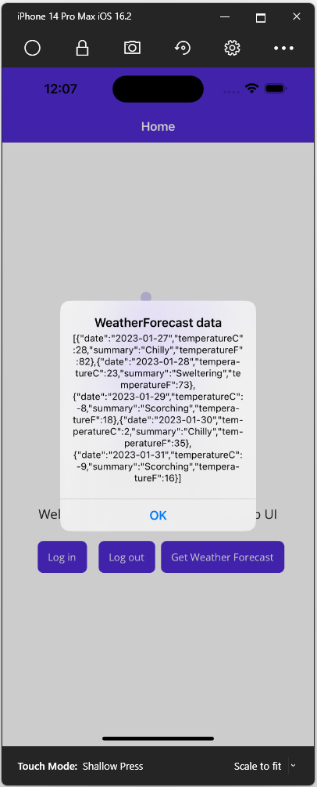

### Running on Windows

To run the application on Windows, you need to add a new redirect URI to your Azure Tenant App Registration.

Go back to the **Azure Portal**, go to your **App registration**, and select the app.

Under the **Authentication** option, make sure **Mobile and desktop applications** is expanded add a new *Redirect URI*.

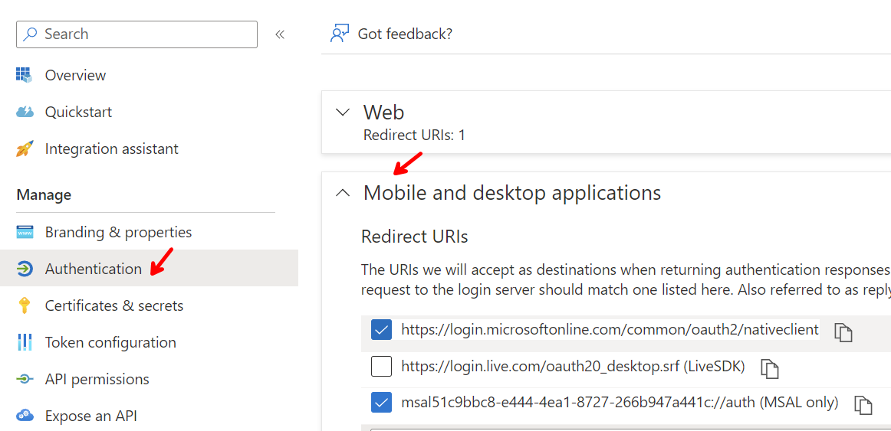  

Click on **Add URI**, and add the following value `urn:ietf:wg:oauth:2.0:oob`, then click on **Save**.

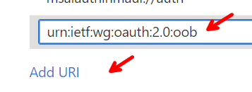  

>:point_up: In MSAL.NET, the default value of the redirect URI is set to "urn:ietf:wg:oauth:2.0:oob". However, this is not recommended as it is prone to change in an upcoming major release, causing a breaking change. So, using a custom redirect URI, is a better approach.

Back in **Visual Studio**, change the target to **Windows**.

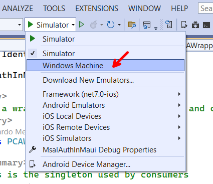  

Run the application.

You should be able to authenticate, get the access token, and call the secure web api successfully to display the weather data.

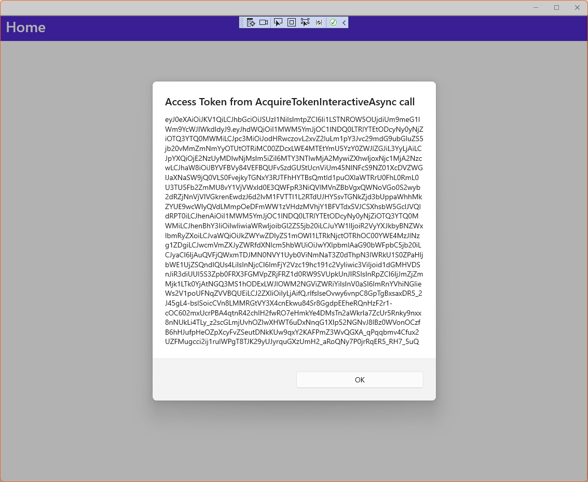  

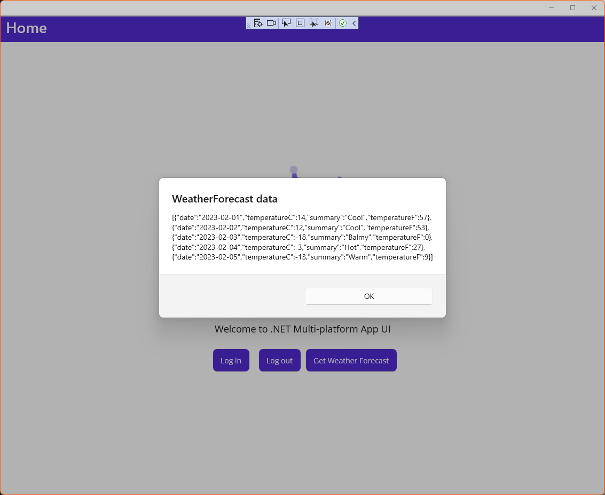  

## Summary

In this episode, we built a secure `ASP.NET Core Web API` application, and we deployed it to `Azure`. Then, we built a `.NET Multi-platform App UI (.NET MAUI)` application, and leveraged the `Microsoft Authentication Library (MSAL)` for `.NET` to get an access token, and used the token call the Web API application securely.

We added support for both Android and iOS platforms.

For more information about the `Microsoft Authentication Library (MSAL)`, check out the links in the resources section below.

## Complete Code

The complete code for this demo can be found in the link below.

- <https://github.com/carlfranklin/MsalAuthInMaui>

## Resources

| Resource                                                                                  | Url                                                                                                        |
| ----------------------------------------------------------------------------------------- | ---------------------------------------------------------------------------------------------------------- |
| The .NET Show with Carl Franklin                                                          | https://thedotnetshow.com                                                                                  |
| Download .NET                                                                             | <https://dotnet.microsoft.com/en-us/download>                                                              |
| Overview of the Microsoft Authentication Library (MSAL)                                   | <https://docs.microsoft.com/en-us/azure/active-directory/develop/msal-overview>                            |
| Minimal APIs overview                                                                     | <https://docs.microsoft.com/en-us/aspnet/core/fundamentals/minimal-apis?view=aspnetcore-6.0>               |
| Microsoft Authentication Library (MSAL) for .NET, UWP, .NET Core, Xamarin Android and iOS | <https://github.com/AzureAD/microsoft-authentication-library-for-dotnet>                                   |
| Microsoft identity platform code samples                                                  | https://docs.microsoft.com/en-us/azure/active-directory/develop/sample-v2-code                             |
| Creating API Keys for App Store Connect API                                               | <https://developer.apple.com/documentation/appstoreconnectapi/creating_api_keys_for_app_store_connect_api> |
| Using web browsers (MSAL.NET)                                                             | <https://learn.microsoft.com/en-us/azure/active-directory/develop/msal-net-web-browsers>                   |
| Considerations for using Xamarin iOS with MSAL.NET                                        | <https://learn.microsoft.com/en-us/azure/active-directory/develop/msal-net-xamarin-ios-considerations>     |
| Entitlements                                                                              | <https://learn.microsoft.com/en-us/dotnet/maui/ios/entitlements?view=net-maui-7.0&tabs=vs>                 |
